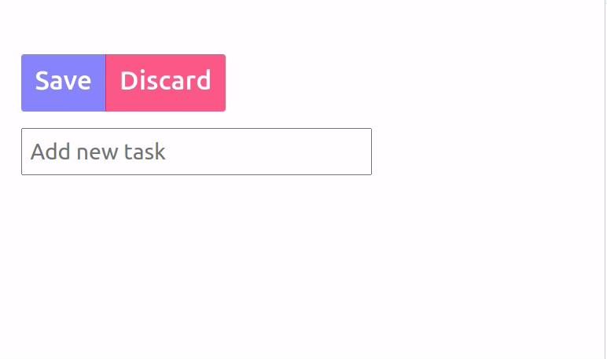
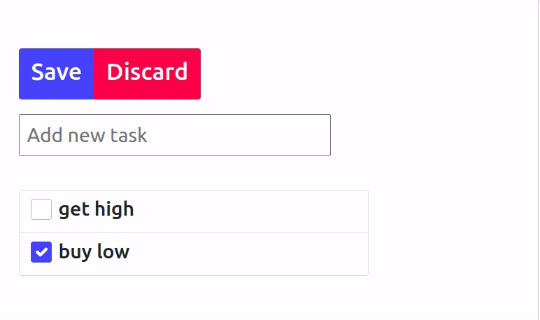
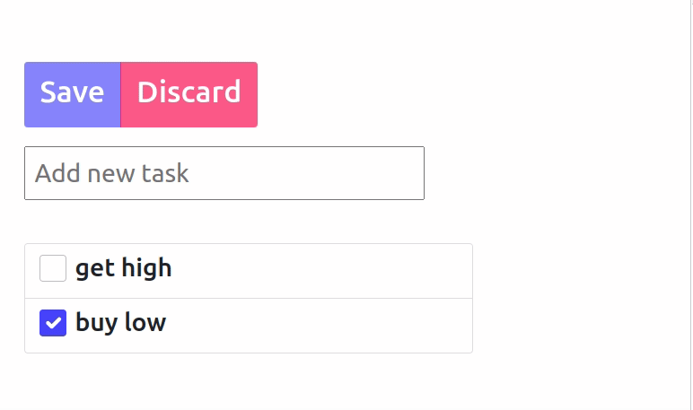
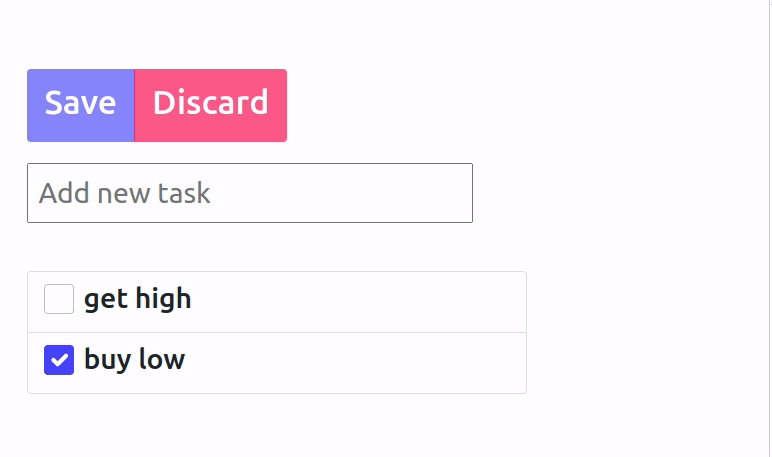

### Visual guide

#### Add todo:


#### Edit todo:


#### Save todo:


#### Discard local changes:


#### remove todo:



### Installation

create venv:

```python3 -m venv venv```

activate venv:

```source venv/bin/activate```

install requirements:

```pip install -r requirements.txt```

Run the server:

```uvicorn app:app --host 0.0.0.0 --port 8000```

### Implemented functionality 

- Create a new todo item.
- Modify an existing todo item.
- Reorder todo items (drag & drop).
- Mark a single todo item as done.
- Save or Discard local changes.

### Not implemented

 - user authentication
 - changes history


